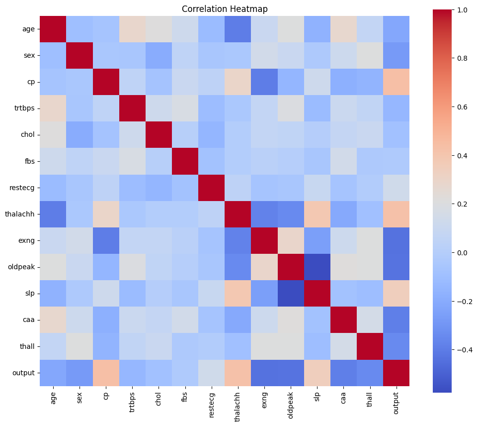
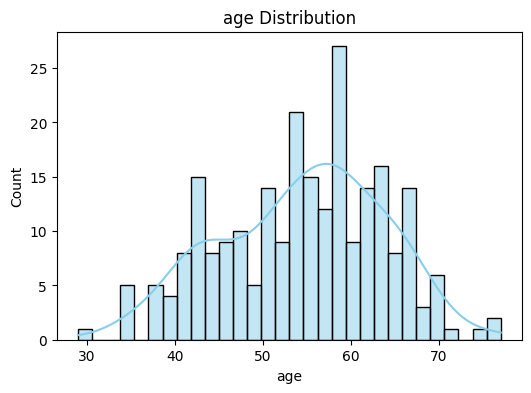
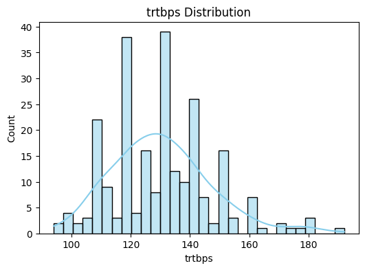
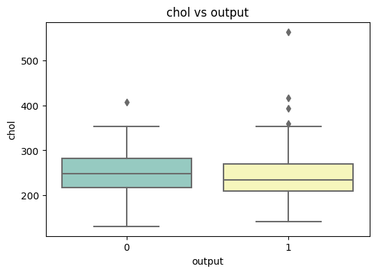

# 📊 Exploratory Data Analysis (EDA) - Heart Attack Prediction

This document provides a detailed data analysis of the **Heart Attack Prediction dataset**.  
The dataset contains patient medical records with features such as **age, blood pressure, cholesterol, maximum heart rate, ST depression, and other indicators**.

---

## ⚖️ Class Distribution

The target variable `output` indicates whether a patient is likely to have a heart attack (1) or not (0).  

- The dataset is relatively balanced, but slightly more patients are at risk (1).  

---

## 🔗 Correlation Heatmap

The correlation heatmap shows relationships between numerical features.  

- **Age** is moderately correlated with **cholesterol** and **resting blood pressure**.  
- **Cholesterol** has weaker correlations with heart attack outcomes compared to other features.  
- **Maximum heart rate (thalachh)** is negatively correlated with age – older patients tend to have lower maximum heart rates.  

---

## 📈 Feature Distributions

### Age Distribution
- Most patients are between **40 and 60 years** old.  
- Fewer patients are under 30 or over 70.  

### Cholesterol Distribution
- The majority of patients have cholesterol between **180 and 280 mg/dl**.  
- High cholesterol (>300) is less common but strongly associated with risk.  

### Resting Blood Pressure (trtbps)
- Normal blood pressure is <120 mmHg, but many patients in the dataset have values above 130, indicating **hypertension** prevalence.  

### Maximum Heart Rate (thalachh)
- Younger patients show higher maximum heart rates (>150).  
- Patients with lower maximum heart rates (<120) are often in the at-risk group.  

---

## 📦 Boxplots: Relation with Heart Attack Output

Boxplots highlight differences in distributions between patients with and without heart attacks.  

- **Cholesterol**: Patients with higher cholesterol show a higher likelihood of heart attack.  
- **Resting Blood Pressure**: Hypertensive patients are more at risk.  

  
  

---

## 🔍 Scatterplot Relationships

Scatterplots show interactions between variables:  

- **Age vs Max Heart Rate**: Younger patients can reach higher heart rates, while older patients tend to have lower limits.  
  

- **Resting BP vs Cholesterol**: Patients with both high blood pressure and high cholesterol are at increased risk.  
  

- **Oldpeak vs Age**: ST depression (oldpeak) is often higher in elderly patients.  
  

---

## 📌 Key Insights

1. **Age** plays a central role – elderly patients tend to have more cardiac risk factors.  
2. **Cholesterol** and **blood pressure** show strong associations with heart attack occurrence.  
3. **Maximum heart rate (thalachh)** is a critical differentiator – lower max HR patients are more at risk.  
4. Combined factors (e.g., high BP + high cholesterol) significantly increase risk.  
5. The dataset provides a good balance of features for building predictive ML models.  

---
