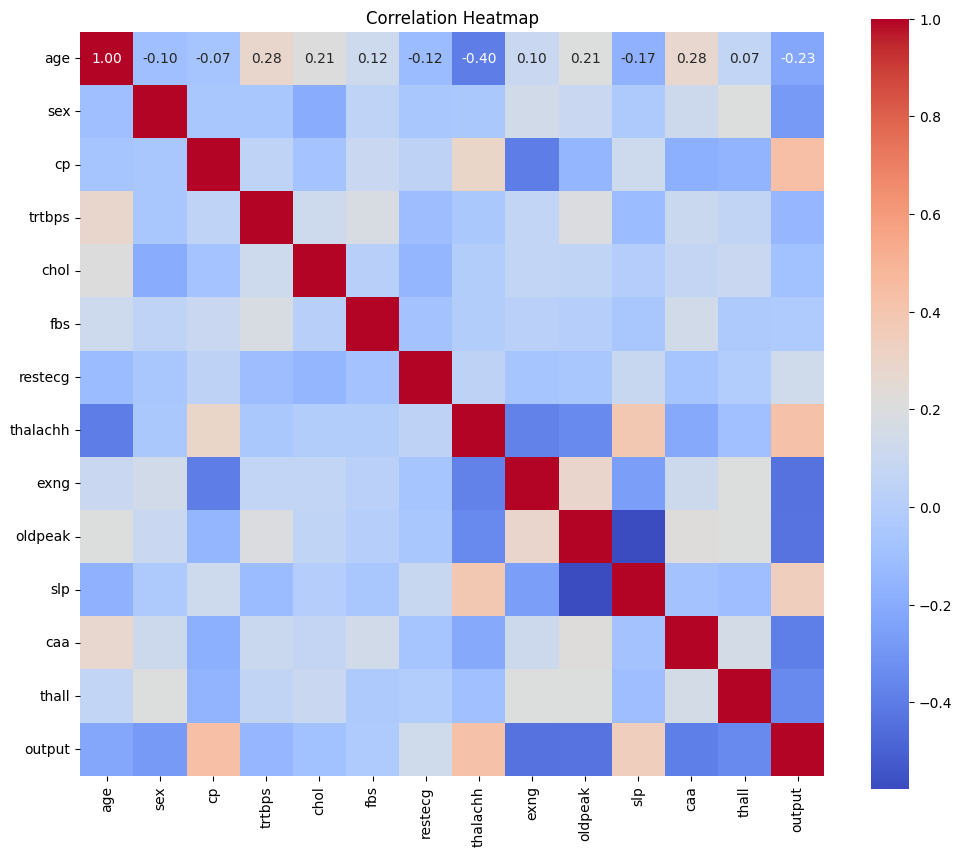
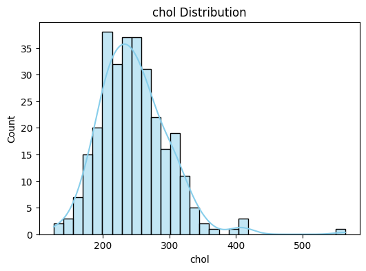
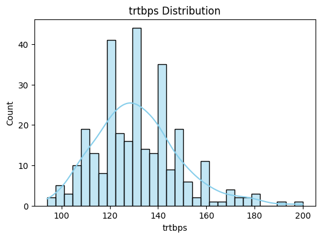
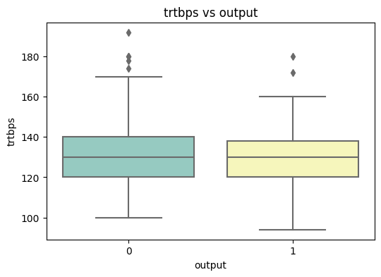
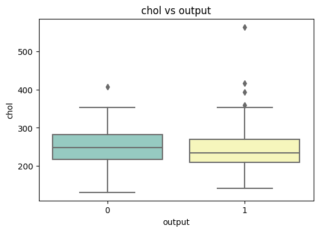
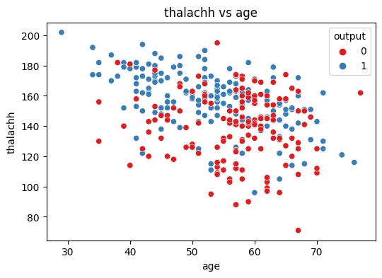
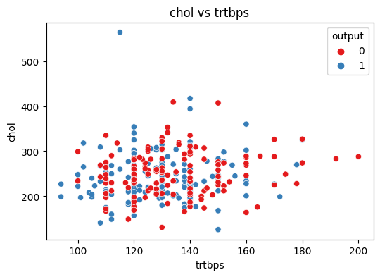
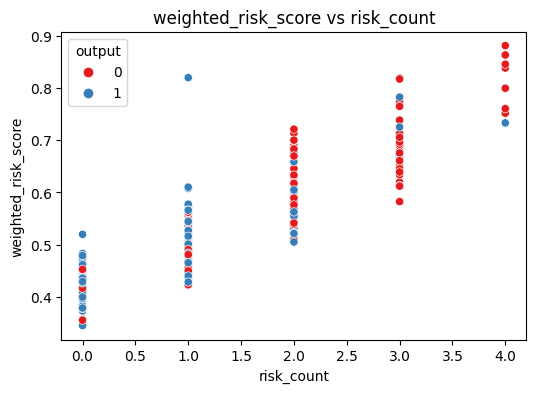
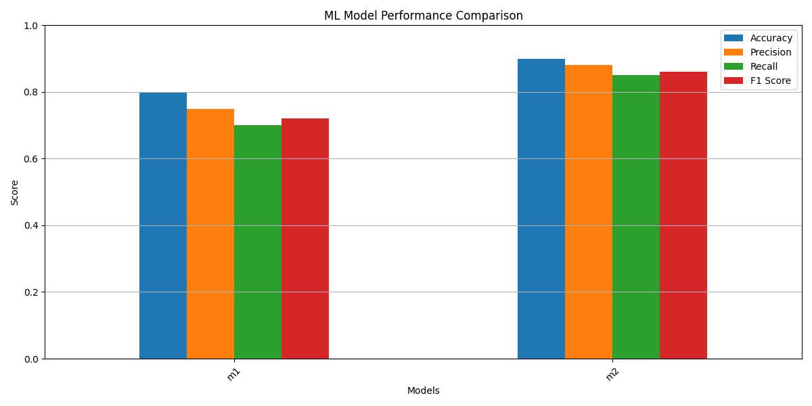

# ❤️ Heart Attack Prediction Project  

A complete **Data Science & Machine Learning pipeline** to predict the likelihood of heart disease using patient health records.  

This project demonstrates:  
- 📊 **Exploratory Data Analysis (EDA)** with professional plots  
- 🛠️ **Feature Engineering** grounded in medical domain knowledge  
- 🤖 **Machine Learning Model Benchmarking** across multiple algorithms  
- 🌐 **Flask Web Application** for real-time predictions  
- 🧪 **Comprehensive Unit Testing** for reliability  

---

## 📂 Project Structure  

```
Heart-Attact-Prediction/
│── data/heart.csv                # Dataset
│── models/                       # Saved models
│── results/model_performance.csv # Model results
│── src/
│   ├── data_utils.py             # Preprocessing & encoding
│   ├── feature_engineering.py    # Feature creation
│   ├── visualize.py              # Visualization & plots
│   └── model.py                  # Training & evaluation
│── static/data_analysis/         # Plots & images
│── templates/                    # Flask HTML templates
│── app.py                        # Flask web app
│── tests/                        # Unit tests
│── requirements.txt              # Dependencies
│── README.md                     # Project documentation
```

---

## 📊 Dataset  

The dataset contains **303 patient records** with 14 medical attributes and a binary outcome (`output: 1 = heart disease, 0 = no disease`).  

Key Features:  
- `age` — patient age (years)  
- `sex` — gender (1 = male, 0 = female)  
- `trtbps` — resting blood pressure (mm Hg)  
- `chol` — serum cholesterol (mg/dl)  
- `thalachh` — maximum heart rate achieved  
- `oldpeak` — ST depression induced by exercise  
- `cp`, `restecg`, `slp`, `caa`, `thall` — categorical medical features  
- `fbs`, `exng` — binary medical indicators  
- `output` — target variable  

---

## 🔍 Exploratory Data Analysis (EDA)  

We analyzed the dataset to understand distributions, correlations, and relationships between features.  

- **Class Distribution**  
    

- **Correlation Heatmap**  
    

- **Feature Distributions**  
    
    

- **Boxplots by Outcome**  
    
    

- **Scatterplots**  
    
    

🔎 Insights:  
- Patients with **higher cholesterol** and **higher resting BP** are more prone to heart disease.  
- **Lower exercise capacity (thalachh)** is strongly associated with disease presence.  

---

## 🛠️ Feature Engineering  

We extended the dataset with domain-driven features:  

✔ **Risk Flags**: Hypertension, Hypercholesterolemia, High ST Depression  
✔ **Categorical Binning**: Age groups, Cholesterol groups, BP groups  
✔ **Interaction Features**: Age/Chol ratio, BP*Oldpeak product  
✔ **Polynomial & Log Features**: Squared terms, log transforms, square roots  
✔ **Composite Risk Scores**: Risk count, weighted risk score, cardiac stress index  

Example engineered feature visualization:  

- **Risk Count vs Weighted Risk Score**  
    

---

## 🤖 Machine Learning Models  

We benchmarked several ML models:  

- Support Vector Classifiers (linear, RBF)  
- Decision Trees (Gini, Entropy)  
- Random Forests (various depths & criteria)  
- K-Nearest Neighbors (k = 5, 15, 25)  
- Gaussian Naive Bayes  

### Model Performance  

  

🏆 **Best performers**: Random Forests and SVMs — achieved high **F1-score** and **balanced Precision-Recall**.  

---

## 🌐 Web Application  

We built a **Flask web app** for real-time predictions.  

- **Homepage (User Input Form)**  
    

- **Prediction Result — Low Risk**  
    

- **Prediction Result — High Risk**  
    

👉 Users can input patient details and instantly see risk predictions.  

---

## 🧪 Testing  

Unit tests ensure reliability across all components:  

- **Data Preprocessing** → `test_data_utils.py`  
- **Feature Engineering** → `test_feature_engineering.py`  
- **Model Training/Evaluation** → `test_model.py`  
- **Visualization** → `test_visualisation.py`  

✔️ All tests run with **pytest** and confirm pipeline correctness.  

---

## ✨ Key Highlights  

- End-to-end **ML pipeline** with modular, reusable code  
- Rich **EDA** with visual storytelling  
- Strong **domain-informed feature engineering**  
- **Model benchmarking** with saved results  
- **Flask app deployment** for real-world usability  
- Full **unit test coverage**  

---

📌 This project demonstrates **practical Data Science skills**: data wrangling, EDA, feature engineering, model building, evaluation, visualization, and deployment.  

---

⚡ **Next Steps / Future Work**:  
- Deploy app on **Heroku / AWS**  
- Add **SHAP explainability** for model interpretation  
- Integrate pipeline into **MLflow** for tracking  

---

🔥 *This project isn’t just code — it’s a showcase of applied ML and end-to-end data science workflow.*  
